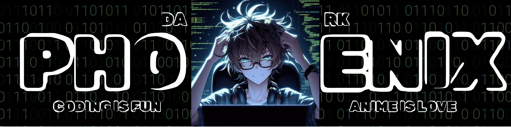

<h1>Welcome Wanderer to the domain of Knowledge</h1>

Greetings, wanderer! I am Pranshu, also known as Dark Phoenix, a developer and designer with a passion for viewing the world through a lens of fantasy. This is my introductory repository where I will guide you through the magical domain of my work and the contents of my tech arsenal.

✨ Don't forget to "Star" if you're interested. Are you ready to step into the domain of fantasy? Here we go! ✨

  <h2>✨ About Me</h2>
        
In the mystical realm of development, I am a sorcerer of:

        <ul>
            <li><strong>Languages & Frameworks:</strong>
                <ul>
                    <li>Python  🐍</li>
                    <li>JavaScript (React, Node.js) 🌐</li>
                    <li>HTML & CSS 🎨</li>
                </ul>
            </li>
          

    
     

            <li><strong>Tools & Technologies:</strong>
                <ul>
                    <li>Git & GitHub 🛠️</li>
                    <li>Docker 🐳</li>
                    <li>SQL & NoSQL Databases 🗃️</li>
                </ul>
            </li>
          

    
     

            <li><strong>Interests & Specialties:</strong>
                <ul>
                    <li>AI and Machine Learning 🤖</li>
                    <li>Game Development 🎮</li>
                    <li>Web Development 🌍</li>
                </ul>
            </li>
          

    
     

        </ul>

 <h2>🎓 Education & Certifications</h2>
        <ul>
            <li><strong>Bachelor’s in Computer Science</strong>, [Your University]</li>
            <li><strong>Certified Kubernetes Administrator (CKA)</strong>, CNCF</li>
            <li><strong>Machine Learning Specialization</strong></li>

            

 <h2>🛠️ Hobbies</h2>
        <ul>
            <li><strong>Bachelor’s in Computer Science</strong>, [Your University]</li>
            <li><strong>Certified Kubernetes Administrator (CKA)</strong>, CNCF</li>
            <li><strong>Machine Learning Specialization</strong></li>

